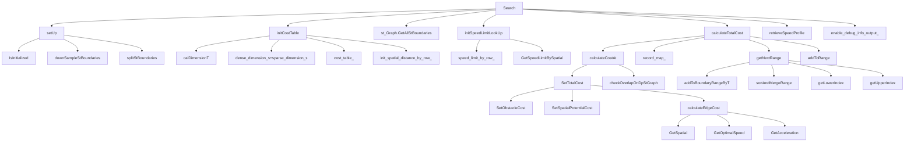

# PATH_TIMEHEURISTIC_OPTIMIZER

## 1 GRIDDED_PATH_TIME_GRAPH

```
Status GriddedPathTimeGraph::Search(STGraph const&          st_graph,
                                    ObstacleQuerier const&  obstacles,
                                    STSemantic const* const st_semantic_ptr,
                                    SpeedData&              speed_data)
主函数

```

```
Status GriddedPathTimeGraph::initCostTable()
初始化cost表
总s维数=密集s的维数+稀疏s维数(稀疏s有可能为0)
cost_table_=二维矩阵（t维数，s维数）存STpoint
spatial_distance_by_row_   存s
```

```
Status GriddedPathTimeGraph::calDimensionT()
计算T的维度，有几个t向上取整
```

```
Status GriddedPathTimeGraph::initSpeedLimitLookUp(SpeedLimit const& speed_limit)
初始化每行的限速构成一个数组 speed_limit_by_row_
```

```
Status GriddedPathTimeGraph::calculateTotalCost()

record_map_:记录连接的两点key为当前时间的s点，value为上一时间的s点
```

```
Status GriddedPathTimeGraph::calculateCostAt(PointIdx const& idx)
计算ST图上点的障碍物代价
代价过大就设为最大值
计算ST图上点的s潜在代价
当col==0时 cost=障碍物代价+潜在代价+0
当col==1时 cost = 障碍物代价+潜在代价+edgecost
当col==2时 cost = 障碍物代价+潜在代价+edgecost
第三列和第二列相同方法计算cost

疑问：point_in_pre_col.GetPrePoint() == nullptr
		第二列的speed_limit为什么选当前列和上一列中较小的
```

```
holo::float64_t GriddedPathTimeGraph::calculateEdgeCost(holo::float64_t const curr_spatial,
                                                        holo::float64_t const curr_speed,
                                                        holo::float64_t const pre_acc,
                                                        holo::float64_t const curr_acc,
                                                        holo::float64_t const speed_limit) const
返回 speed_cost + acc_cost + jerk_cost;
```

```
Status GriddedPathTimeGraph::getNextRange(StGraphPoint const&                           curr_point,
                                          std::vector<std::pair<float64_t, float64_t>>& a_range)
获得下一列的计算范围的点(解空间)
上界为当前s+vt+1/2at2
下界为当前s
a_range 记录解空间
boundary_range 记录障碍物范围
```

```
void GriddedPathTimeGraph::addToBoundaryRangeByT(float64_t const                               time,
                                                 std::vector<std::pair<float64_t, float64_t>>& boundary_range)
获取time时间列的各障碍物上下界
st_boundaries_down_sample_是什么的边界？
```

```
void GriddedPathTimeGraph::sortAndMergeRange(std::vector<std::pair<float64_t, float64_t>>& boundary_range)

vector中的对组排序是依据是s_lower

```

```
void GriddedPathTimeGraph::addToRange(std::set<uint32_t>&                                 range,
                                      std::vector<std::pair<float64_t, float64_t>> const& otherRange)
把otherRange传给range
```

```
Status GriddedPathTimeGraph::retrieveSpeedProfile(SpeedData& speed_data) const
检索速度配置文件
找到最小cost的点，在ST图最上面一行和最右边一列中
根据时间t 对speed_data(vector)排序
```




## 2 ST_FORMATTER

## 3 PATH_TIME_HEURTISTIC_OPTIMIZER

## 4 DP_ST_COST

```
obs_cost 
```

